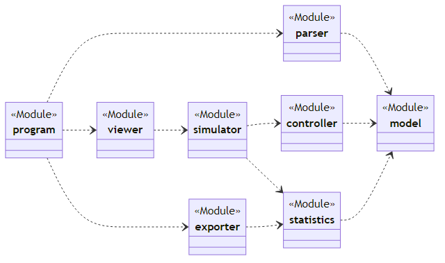
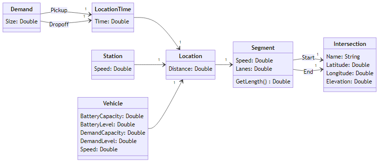
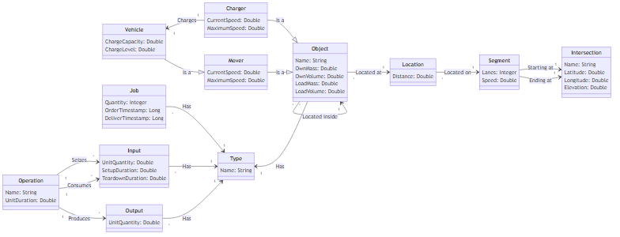
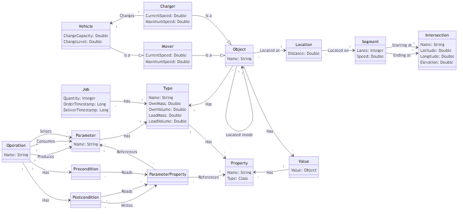
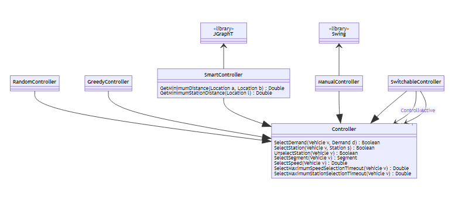
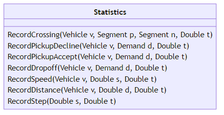

# transport-ide

The goal of **TransportIDE** is to make the life of *transportation infrastructure* and *control algorithm engineers* easier.
We believe that this engineering domain needs new tools and methodologies to develop better systems with higher performance in shorter time and at lower lifetime cost.
In particular, we think that transportation system engineers must be supported better in

1. analyzing requirements for specific application scenarios (e.g. travel time and energy consumption) as well as
2. deriving, verifying, and validating principle solution variants (including transportation, charge, and maintenance infrastructure as well as control strategy).

**TransportIDE** is an *open source software project* initiated by Dr. Georg Hackenberg, Professor for Industrial Informatics, School of Engineering, [University of Applied Sciences Upper Austria](https://fh-ooe.at/).

## Screenshots

This software package supports several use cases from basic simulation to controller and infrastructure comparison.
In the following, we provide brief descriptions and screenshots of the individual use cases.

### 🖼️ Basic simulation

Basic simulation allows one to evaluate system performance for a given controller algorithm and transportation infrastructure.

### 🖼️ Controller comparison

Controller comparison allows one to evaluate system performance for a set of controller algorithms and a given transportation infrastructure.

### 🖼️ Infrastructure comparison

Infrastructure comparison allows one to evaluate system performance for a given controller algorithmn and a set of transportation infrastructures.

## Requirements

To build and run the project you need to following software packages:

- [OpenJDK](https://openjdk.org/) provides the Java compiler and runtime environment
- [Apache Maven](https://maven.apache.org/) provides dependency and build management

To calculate fast routes for your vehicles you need the following software package:

- [JGraphT](https://jgrapht.org/) provides graph algorithms (such as shortest path)

To display the simulation state and performance statistics you need the following software packages:

- [DockingFrames](https://www.docking-frames.org/) provides GUI docking components
- [JFreeChart](https://www.jfree.org/jfreechart/) provides GUI charting components

## Modules

This software packages comprises a number of modules and their dependencies.

### 🧩 Model

#### First version

#### Second version

#### Third version

### 🧩 Controller

### 🧩 Statistics

