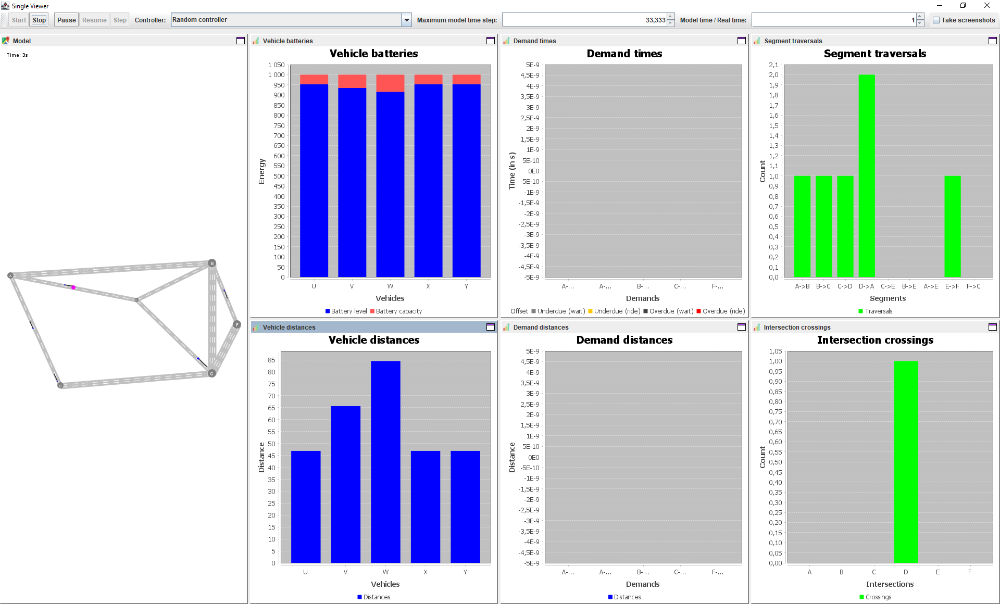
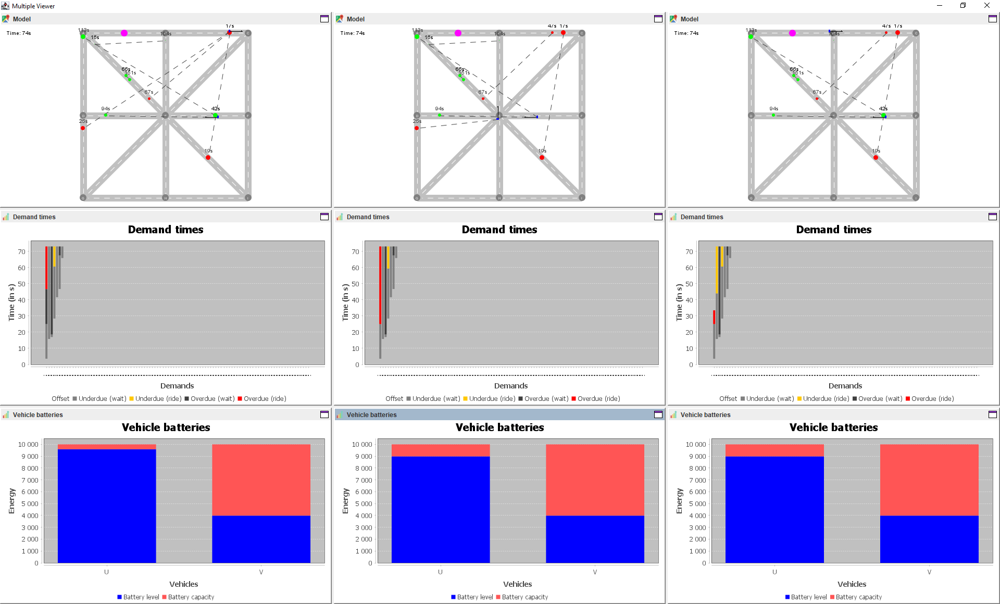
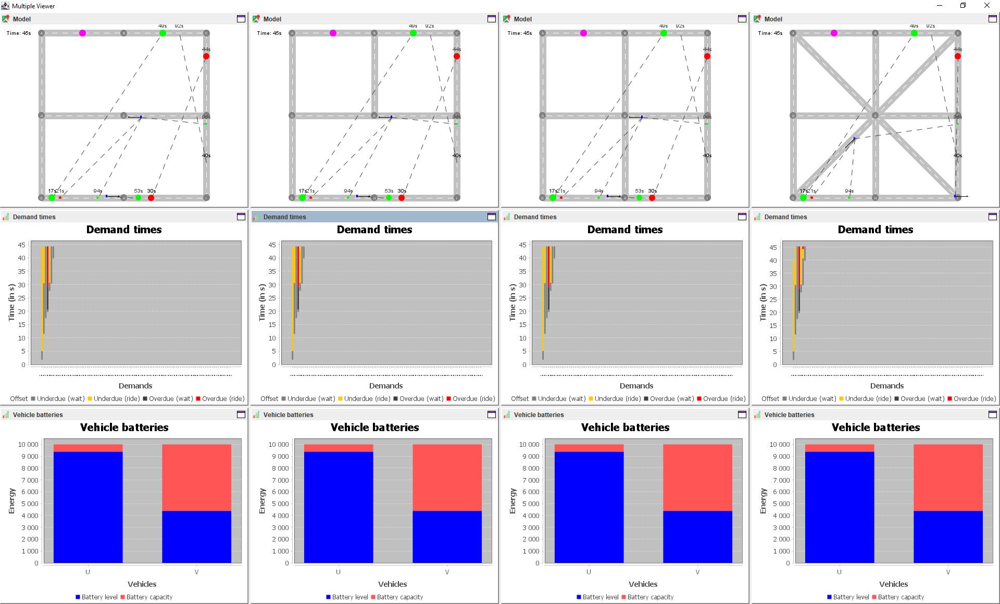

# TransportIDE

The goal of **TransportIDE** is to make the life of *transportation infrastructure* and *control strategy engineers* easier.
We believe that this engineering domain needs new tools and methodologies to develop better systems with higher performance in shorter time and at lower lifetime cost.
In particular, we think that transportation system engineers must be supported better in

1. analyzing requirements for specific application scenarios (e.g. travel time and energy consumption) as well as
2. deriving, verifying, and validating principle solution variants (including transportation, charge, and maintenance infrastructure as well as control strategy).

**TransportIDE** is an *open source software project* initiated by Dr. Georg Hackenberg, Professor for Industrial Informatics, School of Engineering, [University of Applied Sciences Upper Austria](https://fh-ooe.at/) and Dominik Ascher, Research Associate, Distributed Artificial Intelligence Laboratory, [Technical University of Berlin](https://www.tu.berlin/).

## Publications

You can read more about our approach in the proceedings of the following conferences:

- *ISDA 2023 (coming soon)*
- *ITSC 2023 (coming soon)*
- MT-ITS 2017
- ITSC 2016
- ICCVE 2015
- ICCVE 2014

### The passenger extension of the TRANSP-0 system design framework `@ MT-ITS 2017`

Read on [IEEE Xplore](https://ieeexplore.ieee.org/abstract/document/8005676) or cite with our **BibTex entry**:

```bibtex
@inproceedings{ascher_hackenberg_2017,
  author    = {Ascher, Dominik and Hackenberg, Georg},
  booktitle = {2017 5th IEEE International Conference on Models and Technologies for Intelligent Transportation Systems (MT-ITS)},
  title     = {The passenger extension of the TRANSP-0 system design framework},
  year      = {2017},
  volume    = {},
  number    = {},
  pages     = {256-261},
  doi       = {10.1109/MTITS.2017.8005676}
}
```

###  The TRANSP-0 framework for integrated transportation and power system design `@ ITSC 2016`

Read on [IEEE Xplore](https://ieeexplore.ieee.org/abstract/document/7795669) or cite with our **BibTex entry**:

```bibtex
@inproceedings{ascher_hackenberg_2016,
  author    = {Ascher, Dominik and Hackenberg, Georg},
  booktitle = {2016 IEEE 19th International Conference on Intelligent Transportation Systems (ITSC)},
  title     = {The TRANSP-0 framework for integrated transportation and power system design},
  year      = {2016},
  volume    = {},
  number    = {},
  pages     = {945-952},
  doi       = {10.1109/ITSC.2016.7795669}
}
```
### Integrated transportation and power system modeling `@ ICCVE 2015`

Read on [IEEE Xplore](https://ieeexplore.ieee.org/abstract/document/7447633) or cite with our **BibTex entry**:

```bibtex
@inproceedings{ascher_hackenberg_2015,
  author    = {Ascher, Dominik and Hackenberg, Georg},
  booktitle = {2015 International Conference on Connected Vehicles and Expo (ICCVE)},
  title     = {Integrated transportation and power system modeling},
  year      = {2015},
  volume    = {},
  number    = {},
  pages     = {379-384},
  doi       = {10.1109/ICCVE.2015.23}
}
```

### Early estimation of multi-objective traffic flow `@ ICCVE 2014`

Read on [IEEE Xplore](https://ieeexplore.ieee.org/abstract/document/7297511) or cite with our **BibTex entry**:

```bibtex
@inproceedings{ascher_hackenberg_2014,
  author    = {Ascher, Dominik and Hackenberg, Georg},
  booktitle = {2014 International Conference on Connected Vehicles and Expo (ICCVE)},
  title     = {Early estimation of multi-objective traffic flow},
  year      = {2014},
  volume    = {},
  number    = {},
  pages     = {1056-1057},
  doi       = {10.1109/ICCVE.2014.7297511}
}
```

## Screenshots

This software package supports several use cases from basic simulation to controller and infrastructure comparison.
In the following, we provide brief descriptions and screenshots of the individual use cases.

### 🖼️ Basic simulation

Basic simulation allows one to evaluate system performance for a given controller algorithm and transportation infrastructure.



### 🖼️ Controller comparison

Controller comparison allows one to evaluate system performance for a set of controller algorithms and a given transportation infrastructure.



### 🖼️ Infrastructure comparison

Infrastructure comparison allows one to evaluate system performance for a given controller algorithmn and a set of transportation infrastructures.



## Requirements

To build and run the project you need to following software packages:

- [OpenJDK](https://openjdk.org/) provides the Java compiler and runtime environment
- [Apache Maven](https://maven.apache.org/) provides dependency and build management

To calculate fast routes for your vehicles you need the following software package:

- [JGraphT](https://jgrapht.org/) provides graph algorithms (such as shortest path)

To display the simulation state and performance statistics you need the following software packages:

- [DockingFrames](https://www.docking-frames.org/) provides GUI docking components
- [JFreeChart](https://www.jfree.org/jfreechart/) provides GUI charting components

## Modules

This software packages comprises a number of modules and their dependencies.
The following diagram provides an overview of the software modules included.
Technically, the software modules are implemented as Java Jigsaw and Apache Maven modules.



### 🧩 Model

The model represents the core of the application and defines the concepts needed for transportation system design.
We have developed three versions of the model, while only the first version is implemented in the software today.
The other versions of the model are subject to future work.

#### First version

The first version of the model allows one to define road infrastructures, charge infrastructures, vehicles, and transportation demands.



#### Second version

The second version of the model allows one to define more complex transportation demands including chains of transportation activities.



#### Third version

The third versiob of the model allows one to define even more complex transportation demands including parameterizable objects and operations.



### 🧩 Controller

The controller interface is responsible for plugging different control algorithms into the simulation engine.
Through this mechanism, the simulation engine is decoupled from the control strategies, that drive the system behavior.
The module also contains different implementations of the controller interface such as a random controller or a JGraphT-based controller.



### 🧩 Statistics

The statistics interface is responsible for collecting performance data during simulation experiments.
The performance data is necessary to compare infrastructure and control algorithm designs in specific situations.
The interface assumes that performance data is collected only in specific events such as a vehicle passing a road crossing.

