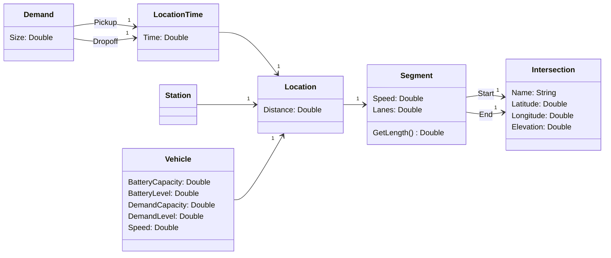

# transport-ide

Transport IDE provides a tool for transportation system designers to analyse requirements (e.g. travel time, energy consumption) as well as to derive, verify, and validate concepts (e.g. transportation infrastructure, control strategy).

## Diagrams

### Model

### Controller

